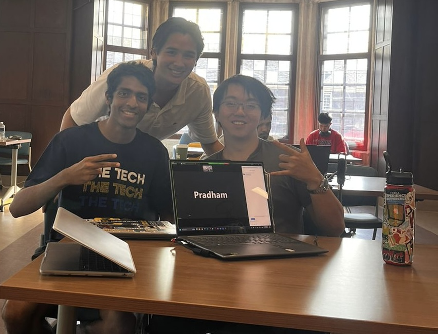
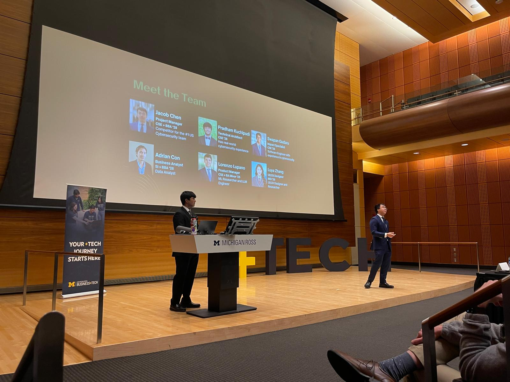
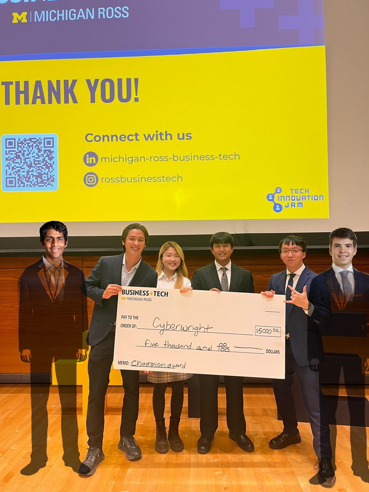

# Cyberwright
Welcome to the Cyberwright Project 👋! Cyberwright is a service designed to act as a "Grammarly" for coders. Leveraging an LLM-based approach to static code analysis, Cyberwright allows users to seamlessly scan and analyze their codebases for improvements and potential issues such as code vulnerabilities or bad code practice. This README provides an overview of our journey of developing this application.

## Timeline
#### **MHacks** - September 28, 2024
Like any good project, the original idea was first brought up over pizza. We were at MHacks 24 and searching for a project idea. Over 3 hours and many slices of dominos, we bounced around countless ideas for projects. In the end, we settled on AI for cybersecurity, a choice that reflected our individual involvement in the field and mutual interest in AI. That decision marked the birth of Cyberwright. Over the next 18 hours, we brought our ideas to life, building a Tauri-based desktop extension that allowed users to scan through their codebases.

During the judging phase, Vaibhav Gupta, founder of the YC-backed startup BoundaryML, was impressed by the versatile nature and UI of our app. His interest only further grew when he uploaded one of his companies repositories, and the app successfully identified potential issues in his codebase. Our app's performance earned us the "Best Use of LLMs" award in BoundaryML's track at MHacks, along with a $500 prize.

*Our team at MHacks*

#### The beginning of the **Ross Business+Tech Innovation Jam** - September 30, 2024
The Ross School of Business at the University of Michigan organizes an annual six-week hackathon called the +Tech Innovation Jam. In this event, students form teams of six to develop a product and create a pitch, essentially following the process of developing a startup and pitching to a venture capital firm. Participants with ideas can establish their own teams, while those looking for a team can join others. With an interest in refining and continuing Cyberwright, [Jacob Chen](https://github.com/Jacob-RC) and [I](https://github.com/pradhamk) decided to create our own team. We recruited 4 other like-minded individuals who shared our passion for enhancing Cyberwright. Each one of us came from our own individual background, making our team incredibly diverse and talented. 

Throughout the six weeks, we diligently worked to rewrite, refine, and optimize Cyberwright's code, making it faster and more user-friendly. Similarly, our team focused on developing a comprehensive business strategy and pitch for the product.

*Some of our team members planning for the pitch*

During this period, we secured a partnership with **UM ITS**, the University of Michigan's IT department. This collaboration allowed us to experiment with various LLMs and develop a functional process for static code analysis. Additionally, we consulted with cybersecurity experts, including **Professor Alex J. Halderman**, **Professor Ang Chen** and **Hemanth Tadepalli**. By incorporating feedback from our discussions with professors, industry experts, and UM ITS, we were able to improve our app significantly. These interactions not only improved our product but also allowed us to build meaningful connections, the most valuable aspect of this competition in my opinion.

We pitched in the GenTech (General Tech) track and scored the highest among 20+ other teams in our track. Securing first place in the track's semifinals earned us a $1,000 prize. With this victory, we advanced to the final round.

#### The *finale* of the **Ross Business+Tech Innovation Jam** - November 19, 2024
The top 6 teams, one for each track, would present to a panel of judges including professors, VC investors, and business owners, and the highest scoring team would win an additional $5000 prize. We were confident going in, having done multiple practice runs and iterations on our content, but the competition was nonetheless fierce.

*Pitching Cyberwright in the Tech Innovation Jam finals*

After we finished, we took a short break for dinner. When we returned, the judges gathered on stage and prepared to announce the winners. First it was the runner up. We didn't win that. Then the audience choice award. No luck. As they got ready to announce the first-place winner, my heart went into overdrive.

"In first place....... Cyberwright!" he called out.

We had won! All the meetings in the Union building, late nights refining code and meetings had paid off in the best possible way.

*Our team with the grand prize check (photoshopped to include those on our team who couldn't make it)*

### Post Tech Innovation Jam
*Note, this section was written by Jacob*

Over winter break, Pradham and I continued to build out the idea. We set up the backend infrastructure, reviewed research papers and started cleaning testing data from cybersecurity competitions. We added many of the features like authentication, rate-limiting, session management and AI customization to the backend. Building out those features was a fun exercise in system design. 

In that time, we were working on getting towards a launching a closed beta. Despite the effort put into building the product, the overarching question about feasibility still remained. 

### What's Next?
After much consideration, we have decided to conclude the development of Cyberwright 😔. This decision is influenced by several factors, with the primary challenge being a significant lack of resources. We would like to acknowledge the complexity of LLM-based static code analysis. It's not a simple idea that can be developed by throwing an LLM at it. This field has undergone extensive research, requiring countless hours and rigorous testing to produce any viable results. While we did manage to develop a process that somewhat reduced false positives by utilizing research from Carnegie Mellon University professors, the issue of false positives is still at large. 

Additionally, large-scale organizations like DARPA are actively working on solutions similar to Cyberwright, making it difficult for a small team to compete in this space. Given these considerations, we believe it’s much more impactful to open-source Cyberwright than to apply a business model for the project.

### Final Remarks
Cyberwright was a project that enabled us to enhance our development skills while building meaningful connections with other UM students. Even after the competition, our team has remained close, despite one member now being in Europe! The process of creating Cyberwright was incredibly rewarding. We enjoyed developing the project and were thrilled by the interest it gained from other UM students and clubs. Ultimately, the connections we formed and the experiences we shared made the hours of hard work and struggle worth it.
